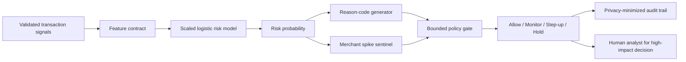

# RiskLens AI

**Explainable payment fraud-spike detection with bounded, auditable interventions.**

RiskLens AI is a defence-only prototype for the **Razorpay AI Buildathon — Track 2: AI Risk Manager**. It scores individual payment events, detects merchant-level fraud bursts, explains the strongest risk signals, and recommends a bounded response:

- `allow`
- `allow_and_monitor`
- `step_up_auth`
- `hold_for_review`

It never recommends a permanent automatic account block. High-impact decisions remain human-gated.

> **Evidence boundary:** all reported results use deterministic synthetic transactions. They demonstrate the evaluation workflow and are not claims about production performance on Razorpay data.

## Held-out evidence

The dataset is split chronologically: 70% training, 15% validation and 15% final testing. The decision threshold is selected on validation data only and then frozen before the held-out test.

| Metric | Held-out result |
|---|---:|
| Test transactions | 1,800 |
| Precision | 75.61% |
| Recall | 87.94% |
| F1 | 81.31% |
| ROC-AUC | 92.73% |
| PR-AUC | 79.18% |
| False-positive rate | 2.41% |
| Confusion matrix | TN 1,619 · FP 40 · FN 17 · TP 124 |

Against the transparent rule baseline, the learned model improved F1 from **52.22% to 81.31%**, reduced the false-positive rate from **9.58% to 2.41%**, and reduced the prototype estimated cost from **₹23,177.32 to ₹8,339.75** under the stated assumptions.

The report also exposes false-positive review cost, caught fraud amount, missed fraud amount, Brier score and a transparent rule baseline. Exact generated values live in [`artifacts/metrics.json`](artifacts/metrics.json).

## Why this is more than a fraud score

1. **Explainable:** every decision returns ranked reason codes based on local model contributions.
2. **Cost-aware:** the threshold minimizes estimated business cost under a recall floor, using validation data only.
3. **Spike-aware:** batch scoring surfaces merchant-level bursts only after minimum volume and flagged-count guards.
4. **Bounded:** model output passes through an explicit policy gate; it cannot permanently block an account.
5. **Auditable:** a privacy-minimized JSONL record stores transaction ID, merchant ID, score, action, reasons and model version—never raw payment credentials.
6. **Honest:** limitations and synthetic-data boundaries are visible in both the UI and model card.

## Architecture



Full design notes: [`docs/ARCHITECTURE.md`](docs/ARCHITECTURE.md).

## Quick start

Windows PowerShell:

```powershell
python -m venv .venv
.\.venv\Scripts\Activate.ps1
python -m pip install -r requirements.txt
python scripts\train_model.py
python -m uvicorn app.main:app --reload
```

Then open:

- Dashboard: <http://127.0.0.1:8000>
- Interactive API documentation: <http://127.0.0.1:8000/docs>
- Health check: <http://127.0.0.1:8000/health>

The application trains a model automatically at startup when no artifact exists, but running the training command explicitly makes the evaluation evidence visible before launch.

## Test

```powershell
python -m unittest discover -s tests -v
```

The test suite covers:

- deterministic data generation;
- chronological split boundaries;
- low-risk and card-testing decisions;
- minimum-volume spike guards;
- audit-data minimization;
- API health, scoring, metrics and validation failures.

## API example

`POST /api/score`

```json
{
  "transaction_id": "txn_demo_burst_001",
  "merchant_id": "merchant_007",
  "amount": 89,
  "avg_amount_30d": 1420,
  "customer_tenure_days": 580,
  "device_age_days": 1,
  "distance_from_home_km": 7,
  "failed_attempts_1h": 6,
  "tx_count_10m": 18,
  "shared_cards_24h": 0,
  "shared_devices_24h": 0,
  "merchant_risk_score": 0.08,
  "hour_of_day": 14,
  "is_international": 0,
  "is_new_device": 1,
  "billing_shipping_mismatch": 0
}
```

The response contains the calibrated risk score, threshold, risk band, recommended action, human-review flag, model version and ranked explanations.

## Data and model

The deterministic generator creates three known defensive scenarios plus ordinary overlap and label noise:

- card-testing bursts;
- account takeover;
- abuse-ring activity;
- a late merchant-level burst to exercise temporal drift.

The current model is a class-balanced logistic classifier. This was chosen over a more opaque ensemble because the submission values reliable explanations and bounded decisions. The model only sees the documented numerical feature contract; `is_fraud`, `attack_type`, IDs and timestamps are excluded.

Read [`docs/MODEL_CARD.md`](docs/MODEL_CARD.md) before interpreting the metrics.

## Repository map

```text
app/                    FastAPI service, decision engine, audit store and UI
src/risklens/           Data generator, feature contract, training and evaluation
scripts/                Reproducible training and run helpers
tests/                  Standard-library unittest suite
artifacts/              Model evidence, coefficients and held-out sample
docs/                   Architecture, model card, pitch and application draft
```

## Submission assets

- [`docs/APPLICATION_ANSWERS.md`](docs/APPLICATION_ANSWERS.md) — form-ready project objective and build challenges
- [`docs/PITCH_SCRIPT.md`](docs/PITCH_SCRIPT.md) — timed five-minute demonstration script
- [`docs/ARCHITECTURE.md`](docs/ARCHITECTURE.md) — component and decision flow
- [`docs/MODEL_CARD.md`](docs/MODEL_CARD.md) — intended use, evaluation and limitations

## Safety

This repository is strictly defensive. It contains no credential theft, payment bypass, card-testing instructions or attack automation. Synthetic scenarios exist only to validate detection and response behaviour.
