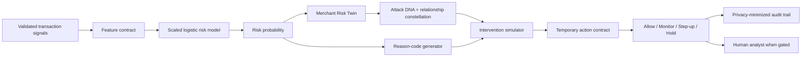

# RiskLens AI

[](https://github.com/SAI6601/RiskLens-AI/actions/workflows/ci.yml)
[](https://www.python.org/)
[](LICENSE)

**A merchant risk twin that detects attack DNA and tests bounded, auditable interventions.**

RiskLens AI is a defence-only prototype for the **Razorpay AI Buildathon — Track 2: AI Risk Manager**. It scores payment events, compares live merchant behaviour with a transparent baseline, fingerprints the strongest attack pattern, reveals privacy-safe relationship hubs, and compares bounded responses before proposing an action:

- `allow`
- `allow_and_monitor`
- `step_up_auth`
- `hold_for_review`

It never recommends a permanent automatic account block. High-impact decisions remain human-gated.

> **Evidence boundary:** all reported results use deterministic synthetic transactions. They demonstrate the evaluation workflow and are not claims about production performance on Razorpay data.

## Held-out evidence

The dataset is split chronologically: 70% training, 15% validation and 15% final testing. The decision threshold is selected on validation data only and then frozen before the held-out test.

| Metric | Held-out result |
|---|---:|
| Test transactions | 1,800 |
| Precision | 75.61% |
| Recall | 87.94% |
| F1 | 81.31% |
| ROC-AUC | 92.73% |
| PR-AUC | 79.18% |
| False-positive rate | 2.41% |
| Confusion matrix | TN 1,619 · FP 40 · FN 17 · TP 124 |

Against the transparent rule baseline, the learned model improved F1 from **52.22% to 81.31%**, reduced the false-positive rate from **9.58% to 2.41%**, and reduced the prototype estimated cost from **₹23,177.32 to ₹8,339.75** under the stated assumptions.

The report also exposes false-positive review cost, caught fraud amount, missed fraud amount, Brier score and a transparent rule baseline. Exact generated values live in [`artifacts/metrics.json`](artifacts/metrics.json).

## Controlled incident safety challenge

Transaction metrics cannot prove that the merchant-level policy behaves safely. A second deterministic challenge therefore checks five contrasting windows end to end:

| Merchant window | Risk Twin | Proposed response | Safety outcome |
|---|---|---|---|
| Ordinary activity | Normal | Allow | Pass |
| Legitimate flash-sale surge | Normal | Allow | Pass |
| Ambiguous device shift | Watch | Allow and monitor | Pass |
| Connected card-testing burst | Attack | Step-up authentication | Pass |
| Card-testing burst during model outage | Attack · degraded | Hold for review · human-gated | Pass |

Run it with `python scripts/evaluate_incidents.py`. The machine-readable report is [`artifacts/incident_challenge.json`](artifacts/incident_challenge.json), and CI fails if any safety invariant fails.

> **Challenge boundary:** these are five hand-authored synthetic merchant windows. A 5/5 pass demonstrates the specified control behaviour; it is not an independent accuracy estimate or production validation.

## Why this is more than a fraud score

1. **Merchant Risk Twin:** compares the current risk, velocity, flagged rate and device novelty with a documented merchant baseline.
2. **Attack DNA:** exposes heuristic affinities for card testing, account takeover and abuse-ring behaviour without claiming attacker identity.
3. **Fraud Constellation:** connects pseudonymous device, instrument, customer and network references to surface shared hubs.
4. **Intervention Simulator:** compares projected residual loss, loss prevented, friction exposure and analyst workload across four responses.
5. **Honest-AI gate:** reduces automation eligibility near decision boundaries or on unfamiliar feature values.
6. **Graceful failure:** a demonstrable degraded mode uses transparent fallback rules, disables automation and human-gates high-impact actions.
7. **Bounded:** every proposed intervention has an expiry, transaction limit and rollback conditions; permanent auto-blocking is outside the design.
8. **Auditable:** privacy-minimized transaction and incident-contract records form a lightweight SHA-256 hash chain—never storing raw card credentials.

## Product experience

The dashboard is structured as a product-film journey: merchant pulse → explainable transaction → live incident replay → bounded action contract. The incident room animates the risk twin, relationship constellation, Attack DNA and four intervention futures. A dismissible seven-step IRIS intelligence guide introduces first-time reviewers to the real controls, adapts its mood to live system state and moves away from the element it is highlighting. Motion remains functional rather than decorative and collapses under the operating system's `prefers-reduced-motion` accessibility setting.

## Architecture



Full design notes: [`docs/ARCHITECTURE.md`](docs/ARCHITECTURE.md).

## Quick start

The reference environment uses Python 3.12 with the reproducible versions pinned in `requirements.txt`.

Windows PowerShell:

```powershell
python -m venv .venv
.\.venv\Scripts\Activate.ps1
python -m pip install -r requirements.txt
python scripts\train_model.py
python scripts\evaluate_incidents.py
python -m uvicorn app.main:app --reload
```

Then open:

- Dashboard: <http://127.0.0.1:8000>
- Interactive API documentation: <http://127.0.0.1:8000/docs>
- Health check: <http://127.0.0.1:8000/health>

The application trains a model automatically at startup when no artifact exists, but running the training command explicitly makes the evaluation evidence visible before launch.

## Test

```powershell
python -m unittest discover -s tests -v
```

The 13-test suite covers:

- deterministic data generation;
- chronological split boundaries;
- low-risk and card-testing decisions;
- minimum-volume spike guards;
- Merchant Risk Twin attack and insufficient-evidence states;
- legitimate flash-sale and ambiguous-watch safety behaviour;
- Attack DNA and privacy-safe relationship hubs;
- degraded-mode automation shutdown and human-gated contracts;
- hash-linked audit integrity;
- audit-data minimization;
- API health, scoring, metrics and validation failures.

## API example

`POST /api/score`

```json
{
  "transaction_id": "txn_demo_burst_001",
  "merchant_id": "merchant_007",
  "amount": 89,
  "avg_amount_30d": 1420,
  "customer_tenure_days": 580,
  "device_age_days": 1,
  "distance_from_home_km": 7,
  "failed_attempts_1h": 6,
  "tx_count_10m": 18,
  "shared_cards_24h": 0,
  "shared_devices_24h": 0,
  "merchant_risk_score": 0.08,
  "hour_of_day": 14,
  "is_international": 0,
  "is_new_device": 1,
  "billing_shipping_mismatch": 0
}
```

The response contains the calibrated risk score, threshold, risk band, recommended action, decision source, confidence gate, human-review flag, model version and ranked explanations.

`POST /api/batch` adds merchant incidents containing the Risk Twin, Attack DNA, Fraud Constellation, intervention comparison and a proposed temporary action contract. Set `simulate_model_failure` to `true` to exercise the documented fallback path; fallback decisions are explicitly labelled and are never automation-eligible.

## Data and model

The deterministic generator creates three known defensive scenarios plus ordinary overlap and label noise:

- card-testing bursts;
- account takeover;
- abuse-ring activity;
- a late merchant-level burst to exercise temporal drift.

The current model is a class-balanced logistic classifier. This was chosen over a more opaque ensemble because the submission values reliable explanations and bounded decisions. The model only sees the documented numerical feature contract; `is_fraud`, `attack_type`, IDs and timestamps are excluded.

Read [`docs/MODEL_CARD.md`](docs/MODEL_CARD.md) before interpreting the metrics.

## Repository map

```text
app/                    FastAPI service, transaction and incident engines, audit store and UI
src/risklens/           Data generator, feature contract, training and evaluation
scripts/                Reproducible training and run helpers
tests/                  Standard-library unittest suite
artifacts/              Model evidence, coefficients and held-out sample
docs/                   Architecture, model card, pitch and application draft
```

## Submission assets

- [Five-minute narrated product pitch](https://github.com/SAI6601/RiskLens-AI/releases/download/v1.0-submission/RiskLens_AI_5_Minute_Pitch.mp4) — 4:57, 1080p walkthrough of the decision journey and failure controls
- [`docs/APPLICATION_ANSWERS.md`](docs/APPLICATION_ANSWERS.md) — form-ready project objective and build challenges
- [`docs/PITCH_SCRIPT.md`](docs/PITCH_SCRIPT.md) — timed five-minute demonstration script
- [`docs/PRESENTATION_STORYBOARD.md`](docs/PRESENTATION_STORYBOARD.md) — cinematic shot plan and delivery guidance
- [`docs/ARCHITECTURE.md`](docs/ARCHITECTURE.md) — component and decision flow
- [`docs/MODEL_CARD.md`](docs/MODEL_CARD.md) — intended use, evaluation and limitations

## Safety

This repository is strictly defensive. It contains no credential theft, payment bypass, card-testing instructions or attack automation. Synthetic scenarios exist only to validate detection and response behaviour.
