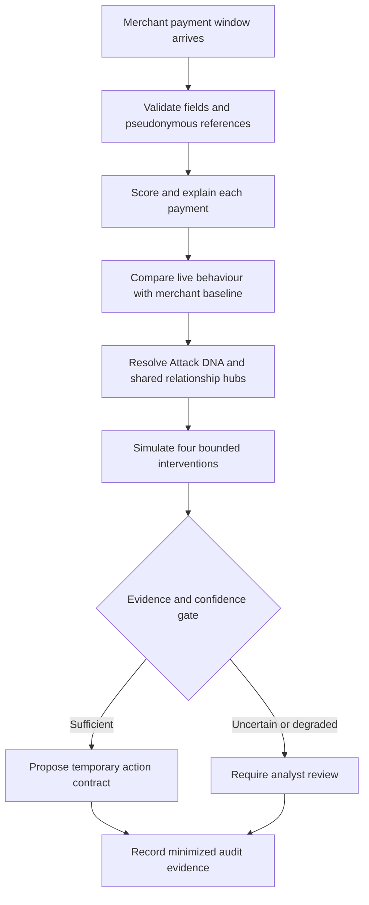
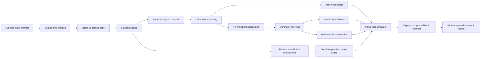

# RiskLens AI architecture

## User-facing decision flow

## Internal processing flow

## Component responsibilities

| Component | Purpose | Key design choice |
|---|---|---|
| `schemas.py` | Reject malformed or extreme inputs | Closed schema; unknown fields rejected |
| `features.py` | Keep training and inference identical | One shared ordered feature contract |
| `training.py` | Train, calibrate and freeze evidence | Chronological split; validation-only threshold |
| `risk_engine.py` | Score, explain and apply action policy | Interpretable contributions and bounded actions |
| `incident_engine.py` | Convert scores into merchant incident intelligence | Transparent baseline deviation, pattern affinities, graph hubs and scenario costs |
| `audit.py` | Preserve decision and proposed-contract evidence | Excludes raw features and links records with SHA-256 hashes |
| `main.py` | Expose dashboard and APIs | Max 500 transactions per batch |
| dashboard | Demonstrate normal and fraud scenarios | Calls the same public APIs as any client |

## Decision policy

| Risk interval | Recommended action | Human impact |
|---|---|---|
| `< 0.20` | Allow | None |
| `0.20` to calibrated threshold | Allow and monitor | Passive observation |
| Threshold to `< 0.82` | Step-up authentication | Reversible verification friction |
| `>= 0.82` | Hold for review | Temporary hold; human decision required |

The calibrated fraud threshold is currently `0.475`. It was selected on validation data only. The `0.82` critical-action boundary is a transparent prototype policy, not a learned production rule.

## Failure handling

- Invalid values and unknown fields return HTTP 422.
- Null model inputs are rejected rather than silently imputed.
- Batch size is bounded to 500 transactions.
- A merchant spike requires at least 5 transactions, 3 flags and a 30% flagged rate.
- Fewer than 5 transactions produces `insufficient_evidence`, never an attack claim.
- A mild `watch` state can only produce monitoring, never a temporary hold.
- Near-boundary or outlying inputs reduce the automation-eligibility heuristic.
- A simulated model outage switches to labelled fallback rules and disables automation.
- High-impact or degraded action contracts require a human gate and always expire.
- Missing model artifacts are reproducibly regenerated at application startup.
- Model-feature mismatch stops startup instead of allowing silent scoring drift.
- The UI exposes API failure messages and never fabricates a decision.

## Production extension path

The prototype intentionally stops short of production deployment. A production design would add authenticated service-to-service access, encrypted event transport, an online feature store, drift monitoring, analyst feedback labels, controlled retraining, model registry approvals and jurisdiction-specific retention controls.
